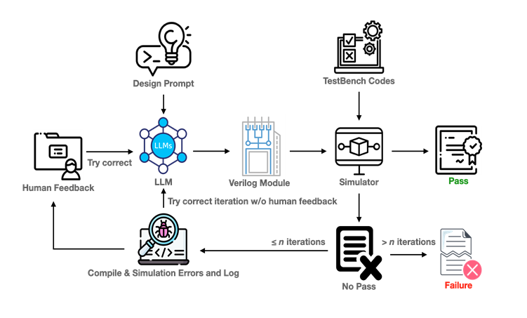

# AutoGenRTL — 自然語言轉 RTL 自動生成工具

## 專案簡介

AutoGenRTL 是一套自動將自然語言描述轉換為 Verilog RTL 模組的架構。該系統結合了大型語言模型（LLM），模仿工程師在編寫代碼時的修正流程，根據每次的錯誤訊息或與預期不同的行為進行迭代修正，並透過 Testbench 驗證生成結果的正確性。

---

## 系統架構圖



---

## 技術亮點

- 使用 OpenAI API 建構語意理解與程式生成流程
- 自訂 Prompt 模板模仿 RTL 工程師的修正邏輯
- 根據錯誤訊息以及非預期行為對 Prompt 進行優化
- 透過生成時序圖增加 Prompt 輸入，提高 sequential 電路的成功率
- Python 串接自動測試系統驗證 Verilog 模組
- 將語言模型應用於硬體開發（HDL）輔助的創新實驗

---

## 獲獎紀錄

| 比賽名稱 | 舉辦單位 | 年份 | 獎項 | 展示 |
|----------|-----------|------|------|--------|
| Let's Chat AI 創意應用競賽 | 長庚大學 | 2024 | 第三名 ( 30 組參賽、10 組晉級決賽) | [查看](awards/lets-chat-ai.md) |
| 全國大專院校產學創新實作競賽人工智慧應用組 | 國立彰化師範大學工學院 | 2024 | 第二名 ( 54 組晉級決賽) | [查看](awards/nicai.md) |
| 數位雙生學生作品競賽 | 社團法人台灣數位雙生學會 | 2024 | 佳作 ( 11 組晉級決賽、4 組佳作) | [查看](awards/dtsc.md) |
| AI 創意競賽 | 中技社 | 2025 | 佳作 ( 54 組參賽、3 組佳作) | [查看](awards/ciit.md) |
| GenAI Stars 百工百業應用選拔 | 數位發展部 數位產業署 | 2025 | 潛力之星獎 ( 269 隊參賽、晉級決審) | — |

---

## 快速開始

### 系統需求

- Python 3.10+
- [Icarus Verilog](https://bleyer.org/icarus/)（`iverilog` / `vvp`）
- Node.js + [wavedrom-cli](https://github.com/wavedrom/cli)（選用，僅時序圖功能需要）

### 安裝依賴

```bash
pip install -r requirements.txt
```

### 設定環境變數

複製 `.env.example` 為 `.env` 並填入你的 API Key：

```bash
cp .env.example .env
```

### 批次測試執行

```bash
python src/main.py
```

執行前可在 `src/main.py` 調整以下參數：

| 參數 | 說明 |
|------|------|
| `IF_GENERATE_WAVEFORM` | 是否在 Testbench 失敗時生成時序圖，以圖片形式提供給 LLM 作為迭代依據 |
| `IF_GENERATE_WAVEFORM_JSON` | 傳遞 wave.json 給 LLM（否則傳圖片），需搭配 `IF_GENERATE_WAVEFORM = True` |
| `max_count` | 最大迭代次數，超過後停止並輸出當前結果 |
| `verilog_tests_name` | `data/` 中要測試的題目資料夾名稱 |
| `result_name` | 結果輸出資料夾名稱，同名時自動生成 result2、result3… |
| `model_matrix` | 使用的 LLM 清單，可放多個依序輪流使用（如 `["gpt-4o", "o1-mini"]`） |

支援的 LLM：`gpt-4`、`gpt-4o`、`gpt-4o-mini`、`gpt-3.5-turbo`、`o1`、`o1-mini`、`o3-mini`、`grok-3-mini-beta`

### 啟動 API 服務

```bash
python bin/run_api.py
```

---

## 專案結構

```
AutoGenRTL-LLM/
├── src/
│   ├── main.py                  # 批次測試入口
│   ├── utils.py                 # 核心邏輯（生成、迭代、驗證）
│   ├── analyze_results.py       # 結果統計分析
│   ├── vcd2json.py              # VCD 波形格式轉換
│   └── api/                    # FastAPI 服務
│       ├── models.py            # Request 格式定義
│       ├── routes.py            # API 路由
│       ├── services/
│       │   └── auto_gen_verilog.py
│       └── utils/
│           ├── llm/             # LLM 呼叫與訊息生成
│           ├── verilog/         # 編譯、模擬、波形生成
│           ├── gen_report.py    # 結果記錄
│           └── read_file.py     # 檔案讀取
├── bin/                        # 啟動腳本
├── awards/                     # 獲獎詳情
├── poster/                     # 海報與系統架構圖
├── data/                       # 測試題目與結果（gitignored）
└── requirements.txt
```

---

## 海報


