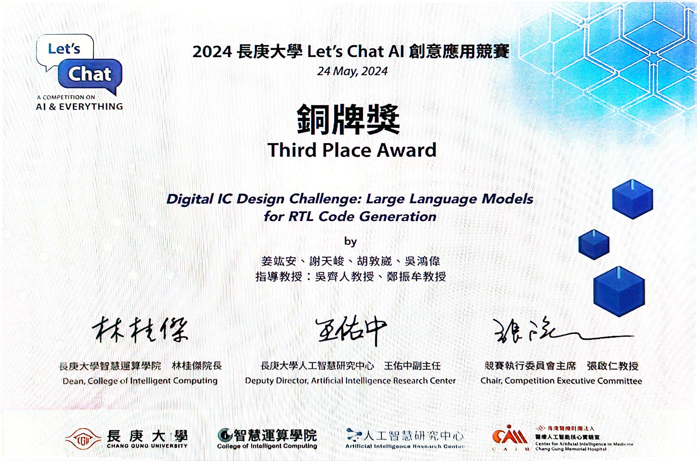

# Let's Chat AI 創意應用競賽 2024 — 第三名

## 比賽資訊
- 主辦單位：長庚大學 Let's Chat AI 計畫團隊
- 時間：2024 年 5 月
- 組別：AI 創意應用組
- 參賽組數：30 組報名、10 組進入決賽
- 得獎名次：**第三名**

## 海報展示

[點我下載 PDF 海報](../poster/lets-chat-ai-poster.pdf)

## 獎狀

[PDF 版本](lets-chat-ai-certificate.pdf)
